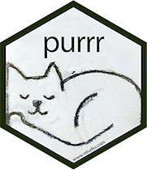

Purrr Tutorial
================
Joyce Robbins

January 10, 2018

<jtr13@columbia.edu> Twitter: @jtrnyc

Note: if you're reading the online version (.md), you may want to switch to the .Rmd version so you can run the code yourself. It is available here:

<a href="https://raw.githubusercontent.com/jtr13/RLadies/master/20180110_Purrr_Workshop.Rmd" download="20180110_Purrr_Workshop.Rmd">Download</a>

Agenda
======

### 1. Why purrr?

(or apply functions)

-   Saves you work (= time)

-   Cleaner code

### 2. <strike>Review of fundamentals</strike> Mindfulness/Vigilance of

-   data types: integer, double, logical, character, factor

-   data structures: vector, data frame / tibble, list (, matrix, array)

... in the context of functions

### 3. Data frames

-   do something to a column

-   do it to every column

### 4. Simple (unnested) lists

-   get the information that you need from each element

-   combine multiple pieces of information into a data frame

### 5. Nested lists

R you ready?
============


Data types
==========

(added after workshop)

### integer

``` r
x <- 1:3
x
```

    ## [1] 1 2 3

``` r
class(x)
```

    ## [1] "integer"

Note: There's no way to tell by just looking at `x` whether it's of type integer or double. It might look the same but be a different type:

``` r
x <- c(1, 2, 3)
x
```

    ## [1] 1 2 3

``` r
class(x)
```

    ## [1] "numeric"

Note: `numeric` is an umbrella category for double and integer; however, if you see "numeric" think "double"

### logical

``` r
x <- c(TRUE, FALSE, FALSE)
x
```

    ## [1]  TRUE FALSE FALSE

Note: no quotes, all caps, only TRUE or FALSE... no brainer

``` r
class(x)
```

    ## [1] "logical"

Not a surprise.

### character

``` r
x <- c("a", "b", "c", "1")
x
```

    ## [1] "a" "b" "c" "1"

Note: the quotes tell you that it's character data.

``` r
class(x)
```

    ## [1] "character"

Indeed.

### factor

``` r
x <- factor(c("a", "b", "c"))
x
```

    ## [1] a b c
    ## Levels: a b c

Notes: No quotes and especially "Levels" are the giveaways that we are dealing we factor data. (Bonus fact: factors are stored as integers, but no need to get into that now.)

``` r
class(x)
```

    ## [1] "factor"

As I said.

Data structures
===============

### vector

``` r
x <- c(3, 4, 5)
x
```

    ## [1] 3 4 5

### data frame / tibble

``` r
library(tidyverse)
tib <- tibble(a = c(1, 2), b = c(3, 4), c = c("cat", "dog"))
tib
```

    ## # A tibble: 2 x 3
    ##       a     b     c
    ##   <dbl> <dbl> <chr>
    ## 1     1     3   cat
    ## 2     2     4   dog

``` r
df <- data.frame(a = c(1, 2), b = c(3, 4), c = c("cat", "dog"))
df
```

    ##   a b   c
    ## 1 1 3 cat
    ## 2 2 4 dog

### list

``` r
x <- list(a = c(first = 1, second = 2),
         b = c(TRUE, FALSE, TRUE), 
         c = c("cat", "dog", "fish", "elephant"))
```

What does the data structure look like? (You need to know what you have! Hypervigilance!)

My 3 go-tos:

1.  

``` r
x
```

    ## $a
    ##  first second 
    ##      1      2 
    ## 
    ## $b
    ## [1]  TRUE FALSE  TRUE
    ## 
    ## $c
    ## [1] "cat"      "dog"      "fish"     "elephant"

1.  


``` r
str(x)
```

    ## List of 3
    ##  $ a: Named num [1:2] 1 2
    ##   ..- attr(*, "names")= chr [1:2] "first" "second"
    ##  $ b: logi [1:3] TRUE FALSE TRUE
    ##  $ c: chr [1:4] "cat" "dog" "fish" "elephant"

1.  Object Explorer

(To use View(x) with lists, you need RStudio v1.1 -- or, for future readers v1.1 or later -- see more about Object Explorer here: <https://blog.rstudio.com/2017/10/09/rstudio-v1.1-released/>)

``` r
xvar <- rnorm(10)
yvar <- xvar + rnorm(10)
mod <- lm(yvar ~ xvar)
# Go to Object Explorer
```

Simple functions
================

``` r
x <- 1:10
x
```

    ##  [1]  1  2  3  4  5  6  7  8  9 10

What's the input? What's the output?

``` r
min(x)
```

    ## [1] 1

What's the input? What's the output?

``` r
mean(x)
```

    ## [1] 5.5

What's the input? What's the output?

``` r
length(x)
```

    ## [1] 10

More simple functions
=====================

What's going on now?

``` r
sqrt(x)
```

    ##  [1] 1.000000 1.414214 1.732051 2.000000 2.236068 2.449490 2.645751
    ##  [8] 2.828427 3.000000 3.162278

``` r
round(x + .5)
```

    ##  [1]  2  2  4  4  6  6  8  8 10 10

``` r
y <- x/10 + 1.05
y
```

    ##  [1] 1.15 1.25 1.35 1.45 1.55 1.65 1.75 1.85 1.95 2.05

``` r
round(y, 1)
```

    ##  [1] 1.2 1.2 1.4 1.5 1.6 1.6 1.8 1.8 2.0 2.0

We were able to do the same thing (take the square root) of every element of a vector the same way we would take the square root of a single number because that's the way vectors work in R. (This is not the case for most other languages!)

Now we're ready to up our game and learn how to do the same thing to every column of a data frame. To do so, we'll use `map` (or `lapply`). (There are plenty of other ways to work with data frames, but this is a `purrr` workshop so we're going to use `purrr` functions. Once we get comfortable using `purrr` functions with data frames, we'll move on to lists where you'll see the real power of the functions.)

Data frames
===========

### Do the same thing to every column:

``` r
df <- data.frame(
  x = c(3, 4, 5, 6),
  y = c(7, 8, 9, 10),
  z = c(11, 12, 13, 14))
df
```

    ##   x  y  z
    ## 1 3  7 11
    ## 2 4  8 12
    ## 3 5  9 13
    ## 4 6 10 14

How do we take the mean of each column?

``` r
# Works, but not the best choice:
for (i in 1:3) print(mean(df[,i]))
```

    ## [1] 4.5
    ## [1] 8.5
    ## [1] 12.5

``` r
# Do this:
lapply(df, mean)
```

    ## $x
    ## [1] 4.5
    ## 
    ## $y
    ## [1] 8.5
    ## 
    ## $z
    ## [1] 12.5

Mindfulness note: we put in a data frame and got back a *list*.

``` r
# Or this:
library(tidyverse)
map(df, sum)
```

    ## $x
    ## [1] 18
    ## 
    ## $y
    ## [1] 34
    ## 
    ## $z
    ## [1] 50

Mindfulness note: once again, we put in a data frame and got back a *list*.

Find the mean snowfall by day (that is, find the mean for each column separately)

Data: <https://raw.githubusercontent.com/jtr13/RLadies/master/snow.csv>

Original data source: <https://www.ncdc.noaa.gov/snow-and-ice/daily-snow/NY/snowfall/20170201>

Data notes: Each column represents the number of inches of snow in each of 349 collecting stations in New York State during one day in February 2017.

``` r
snow <- read_csv("https://raw.githubusercontent.com/jtr13/RLadies/master/snow.csv")
dim(snow)
```

    ## [1] 349  28

``` r
# Uncomment if you're running the code yourself:
# View(snow) 
```

Let's try the same method we used before to get the mean of each column:

``` r
snowmeans <- map(snow, mean)
snowmeans[1:3]
```

    ## $`Feb 1`
    ## [1] NA
    ## 
    ## $`Feb 2`
    ## [1] NA
    ## 
    ## $`Feb 3`
    ## [1] NA

We have a problem: the NAs are causing the means to be NA as well

One solution: write a function to remove the NAs and then take the mean

``` r
snowmean <- function(x) mean(na.omit(x))

# test it
snowmean(c(NA, 3, 5))
```

    ## [1] 4

``` r
dailymeans <- map(snow, snowmean)
dailymeans[1:3]
```

    ## $`Feb 1`
    ## [1] 2.124833
    ## 
    ## $`Feb 2`
    ## [1] 1.40939
    ## 
    ## $`Feb 3`
    ## [1] 1.065873

It works!

### Simply your code by making the function *anonymous*

By replacing the function *name* with the function *contents* (think: algebraic substitution) we get a function with no name that performs just like the named one.

``` r
# from before:
snowmean <- function(x) mean(na.omit(x))
total <- map(snow, snowmean)
```

### Version 1: replace function name with function contents

``` r
total <- map(snow, function(x) mean(na.omit(x)))
total[1:3]
```

    ## $`Feb 1`
    ## [1] 2.124833
    ## 
    ## $`Feb 2`
    ## [1] 1.40939
    ## 
    ## $`Feb 3`
    ## [1] 1.065873

### Version 2: replace "x" with ".x" (Do not be intimidated by the "." It's just a weirdly named variable.)

``` r
.n <- "Hi. My name starts with a dot. Does yours?"
.n
```

    ## [1] "Hi. My name starts with a dot. Does yours?"

``` r
total <- map(snow, function(.x) mean(na.omit(.x)))
total[1:3]
```

    ## $`Feb 1`
    ## [1] 2.124833
    ## 
    ## $`Feb 2`
    ## [1] 1.40939
    ## 
    ## $`Feb 3`
    ## [1] 1.065873

(So far you can do the same with `lapply`)

### Version 3: Use a `purrr` shortcut:

Replace "`function(.x)`" with "`~`" (if so, you must use `.x`, not `.a, .b, .y` or anything else)

*This is unique to* **`purrr`** *functions.*

-&gt; If you don't like this notation, stick with named functions! (Until writing out "function" becomes tiresome...)

``` r
total <- map(snow, ~mean(na.omit(.x)))
total[1:3]
```

    ## $`Feb 1`
    ## [1] 2.124833
    ## 
    ## $`Feb 2`
    ## [1] 1.40939
    ## 
    ## $`Feb 3`
    ## [1] 1.065873

Another solution (thanks RLadies workshop participants!):

Pass an additional parameter to `map`:

``` r
snowmeans <- map(snow, mean, na.rm= TRUE)
snowmeans[1:3]
```

    ## $`Feb 1`
    ## [1] 2.124833
    ## 
    ## $`Feb 2`
    ## [1] 1.40939
    ## 
    ## $`Feb 3`
    ## [1] 1.065873

(also works with `lapply`)

Another example of passing an additional parameter to `map`:

``` r
x <- tibble(a = rnorm(5), b = rnorm(5), c = rnorm(5))
x
```

    ## # A tibble: 5 x 3
    ##            a          b           c
    ##        <dbl>      <dbl>       <dbl>
    ## 1  1.4998104  1.3038023  0.04236186
    ## 2  1.9021303  1.5180530 -0.54015698
    ## 3 -1.2469500 -0.5079473  1.56019434
    ## 4 -1.2589416  0.7931029  1.16991373
    ## 5  0.5942792 -0.4698195  2.38422279

``` r
map(x, round, 1)
```

    ## $a
    ## [1]  1.5  1.9 -1.2 -1.3  0.6
    ## 
    ## $b
    ## [1]  1.3  1.5 -0.5  0.8 -0.5
    ## 
    ## $c
    ## [1]  0.0 -0.5  1.6  1.2  2.4

Typed functions (`map_dbl`, `map_int`, `map_lgl`, `map_chr`)
============================================================

Why? Often we would prefer to get back a vector rather than a list.

``` r
map_dbl(snow, ~mean(na.omit(.x)))
```

    ##        Feb 1        Feb 2        Feb 3        Feb 4        Feb 5 
    ## 2.1248327759 1.4093902439 1.0658727273 0.9809073359 0.2322957198 
    ##        Feb 6        Feb 7        Feb 8        Feb 9       Feb 10 
    ## 0.3082222222 0.1495208333 0.0551860465 2.7946575342 2.3280985915 
    ##       Feb 11       Feb 12       Feb 13       Feb 14       Feb 15 
    ## 0.9656834532 0.4401037344 4.9662014134 0.5274107143 0.4608695652 
    ##       Feb 16       Feb 17       Feb 18       Feb 19       Feb 20 
    ## 1.8786120996 0.5969787986 0.0075189394 0.0000000000 0.0000000000 
    ##       Feb 21       Feb 22       Feb 23       Feb 24       Feb 25 
    ## 0.0000000000 0.0000000000 0.0000000000 0.0000212766 0.0154185022 
    ##       Feb 26       Feb 27       Feb 28 
    ## 0.4176482213 0.0708846154 0.0001411290

-&gt; `map()` returns a LIST of double, `map_dbl()` returns a VECTOR of double

-&gt; `map_lgl()`, `map_int()`, `map_chr()` all return VECTORS of type ...

RECAP -&gt; We can do the same thing to every column of a data frame

-&gt; Get the function to work on one vector before you try it on the whole data frame

Lists
=====

``` r
x <- list(a = c(first = 1, second = 2),
         b = c(TRUE, FALSE, TRUE), 
         c = c("cat", "dog", "fish", "elephant"))
```

### Get the particular items from a list

First item:

``` r
map(x, 1)
```

    ## $a
    ## [1] 1
    ## 
    ## $b
    ## [1] TRUE
    ## 
    ## $c
    ## [1] "cat"

(I swear this was not intentional. `purrr` works in strange ways.)



Second item:

``` r
map(x, 2)
```

    ## $a
    ## [1] 2
    ## 
    ## $b
    ## [1] FALSE
    ## 
    ## $c
    ## [1] "dog"

Third item:

``` r
map(x, 3)
```

    ## $a
    ## NULL
    ## 
    ## $b
    ## [1] TRUE
    ## 
    ## $c
    ## [1] "fish"

Last item:

``` r
map(x, tail, 1)
```

    ## $a
    ## second 
    ##      2 
    ## 
    ## $b
    ## [1] TRUE
    ## 
    ## $c
    ## [1] "elephant"

``` r
lapply(x, tail, 1)
```

    ## $a
    ## second 
    ##      2 
    ## 
    ## $b
    ## [1] TRUE
    ## 
    ## $c
    ## [1] "elephant"

### Get the named items from a list:

``` r
organizers <- list(
  list(firstname = "Soumya", lastname = "Kalra"),
  list(firstname = "Brooke", lastname = "Watson"),
  list(firstname = "Emily", lastname = "Zabor"),
  list(firstname = "Gabriela", lastname = "Hempfling"),
  list(firstname = "Emily", lastname = "Robinson"),
  list(firstname = "Jasmine", lastname = "Williams"),
  list(firstname = "Birunda", lastname = "Chelliah"))
```

``` r
map_chr(organizers, "firstname")
```

    ## [1] "Soumya"   "Brooke"   "Emily"    "Gabriela" "Emily"    "Jasmine" 
    ## [7] "Birunda"

Create a data frame from a list:

``` r
map(organizers, `[`, "firstname")
```

    ## [[1]]
    ## [[1]]$firstname
    ## [1] "Soumya"
    ## 
    ## 
    ## [[2]]
    ## [[2]]$firstname
    ## [1] "Brooke"
    ## 
    ## 
    ## [[3]]
    ## [[3]]$firstname
    ## [1] "Emily"
    ## 
    ## 
    ## [[4]]
    ## [[4]]$firstname
    ## [1] "Gabriela"
    ## 
    ## 
    ## [[5]]
    ## [[5]]$firstname
    ## [1] "Emily"
    ## 
    ## 
    ## [[6]]
    ## [[6]]$firstname
    ## [1] "Jasmine"
    ## 
    ## 
    ## [[7]]
    ## [[7]]$firstname
    ## [1] "Birunda"

``` r
map_df(organizers, `[`, c("firstname", "lastname"))
```

    ## # A tibble: 7 x 2
    ##   firstname  lastname
    ##       <chr>     <chr>
    ## 1    Soumya     Kalra
    ## 2    Brooke    Watson
    ## 3     Emily     Zabor
    ## 4  Gabriela Hempfling
    ## 5     Emily  Robinson
    ## 6   Jasmine  Williams
    ## 7   Birunda  Chelliah

-&gt; Only works if each column has the same number of elements and the elements are named

Nested lists
============

``` r
library(jsonlite)
nobel <- fromJSON("http://api.nobelprize.org/v1/prize.json")
```

``` r
year <- nobel$prizes$year
category <- nobel$prizes$category
laureates <- nobel$prizes$laureates
# View(laureates)
```

What is the total number of people who have won nobel prizes?

``` r
winners <- map(laureates, "surname")

sum(map_int(winners, ~length(.x)))
```

    ## [1] 923

That sum includes organizations... how many individual (people) winners are there? To find out, we need to remove the organizations:

``` r
removeblank <- function(x) {
  x[x != ""]
}

winners <- map(winners, removeblank)

sum(map_int(winners, ~length(.x)))
```

    ## [1] 892

Alternatively, we could combine the above into one function call:

``` r
sum(map_int(winners, ~length(.x[.x != ""])))
```

    ## [1] 892

And finally another approach:

``` r
laureates %>% 
  map("surname") %>% 
  unlist %>% 
  enframe %>% 
  filter(value != "") %>% 
  nrow
```

    ## [1] 892

(If you have a better way of doing this let me know!)

For more practice with `purrr`, see:

1.  Jenny Bryan's "repurrrsive" package

2.  <https://github.com/jdorfman/awesome-json-datasets>

Thanks for attending! Feel free to be in touch with comments or questions:

Joyce Robbins

<jtr13@columbia.edu> @jtrnyc
