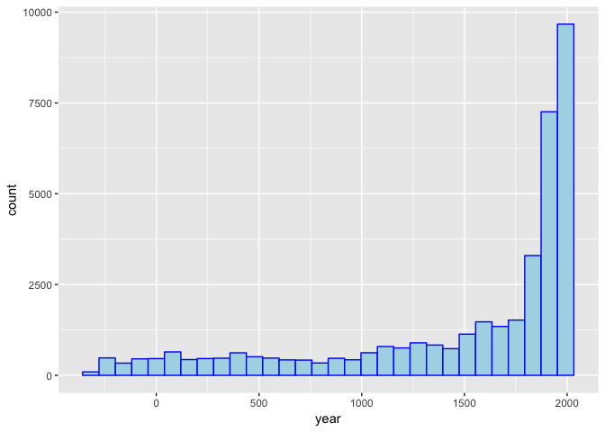

Purrr Solutions
================
Joyce Robbins
1/10/2018

1.  Draw a histogram of the years found in this database of historical events:

<http://www.vizgr.org/historical-events/search.php?format=json&begin_date=-3000000&end_date=20151231&lang=en>

(Hint: use jsonlite::fromJSON to read the file)

``` r
library(jsonlite)
library(tidyverse)
```

    ## ── Attaching packages ───────────── tidyverse 1.2.1 ──

    ## ✔ ggplot2 2.2.1     ✔ purrr   0.2.4
    ## ✔ tibble  1.3.4     ✔ dplyr   0.7.4
    ## ✔ tidyr   0.7.2     ✔ stringr 1.2.0
    ## ✔ readr   1.1.1     ✔ forcats 0.2.0

    ## ── Conflicts ──────────────── tidyverse_conflicts() ──
    ## ✖ dplyr::filter()  masks stats::filter()
    ## ✖ purrr::flatten() masks jsonlite::flatten()
    ## ✖ dplyr::lag()     masks stats::lag()

``` r
url <- "http://www.vizgr.org/historical-events/search.php?format=json&begin_date=-3000000&end_date=20151231&lang=en"
mydata <- fromJSON(url)
mydata <- mydata$result # unnest one level
mydata[[1]] <- NULL # remove first element
dates <- map_chr(mydata, ~.x$date) %>% parse_number() %>% data.frame(year = .)
ggplot(dates, aes(x = year)) + geom_histogram(color = "blue", fill = "lightblue")
```

    ## `stat_bin()` using `bins = 30`. Pick better value with `binwidth`.



1.
